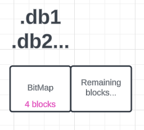

# Key-Value NoSQL Database with Btree Indexing
This is a course project for CS 7280: Special Topics in Database Management, Project 2. Implement a Key-Value based NoSQL database with a command line interface. Commands include open, put, get, rm, dir, find, kill, and quit.

## Contributors
- Yuhan Fang   002194983
- Luyan Deng   002665782

## File System Design
NoSQL database is based on Portable File System (PFS). 

#### PFS (i.e., database file):
- File name: [database_name].db0
    - E.g.: test_group1.db0, test_group1.db1 . . .
- Initial allocated size is 1,024 Kbytes (i.e., 1 Mbytes). Then, automatically
  increased by 1,024 Kbytes if needed (i.e., in case of full).
- Block based: block size = 256 bytes
- Block allocation method: Linked allocation

### .db0 Design
.db0 is the first PFS file that our database created. It is stored in our root directory. The initial allocated size is 1,024 Kbytes (i.e., 1 Mbyte). It contains 4,000 blocks (1,024 Kbytes / 256 bytes = 4,000), with each block being 256 bytes.
Therefore, our block numbers start with 0 and end with 3,999.
- Block 0-5 will store Head Blocks,
- The remaining 3994 will be index block or data block.


#### Head blocks
It stored all the head blocks(include bitmap, super block metadata and FCBs).
- Block 0-3 will store Head Block
- block 4 will store SuperBlock
- block 5 will store FCBs block


##### Bit Map
Hexadecimal bitmap for the free block list: '1' indicates a used block, and '0' indicates a free block. '0' -> '0000', 'F' -> '1111'. Each .db file contains one bitmap in the first 4 blocks.
- 1 byte could represent 4 blocks
- one 256 block could represent: 4 * 256 = 1024 blocks
- 4000/ 1024 = 4  bit map takes 4 blocks for each .db file.


##### Super Block
The super block contains all the metadata of the database and is only contained in .db0. It includes the database name, the number of FCB files, the number of PFS files, and the block size. This information is stored only in .db0.


##### FCBs(File control block)
Each FCB contains name, time, # of blocks, the block pointer for data block start pointer, and a block pointer for the index block root pointer. 
- Each FCB takes 58 bytes
- Each block could contain 4 FCB metadata.
- If 1 FCBs block is full, we could always find another empty block to store more information.


#### Index Blocks
The index block uses a B-tree index. Each block can contain 11 records (in KeyPointer format) and 12 child node pointers (in BlockPointer format). Each KeyPointer contains one key and one data block pointer, which indicates where the data is stored. Each child node pointer for the index block is a block pointer, indicating which block stores the next node. If a node has no child, the child node pointer will be set to "9999999".


#### Data Blocks
The key is an integer, and the value is truncated to 40 bytes per record. Each block can store 6 records (40 bytes each) and 1 block pointer (7 bytes) at the end.

For each record, we store the key and value as characters. We are using linked allocation, so the block pointer points to the next contiguous block. If it reaches the end of the data block, the block pointer will be "9999999".


### .dbN(excluding .db0) Design
When the .db0 file is full, our database will create a new .db file to store more data. Subsequent .dbN files (.db1, .db2, etc.) store the bitmap in the first 4 blocks. The remaining blocks will be either index blocks or data blocks.




### How to Start this Program
Compile and run our program by typing this command
```shell
sh start.sh
```

### Commends
All the uploaded CSV file should store in ./csvs, and case is sensitive.


#### Open a database
```shell
open <DatabaseName>
```

### Exit NoSQL database
```shell
quit
```

#### Delete the NoSQL database
```shell
kill <Filename>.csv
```

### While you open a database
#### Insert csv file from your os to your NoSQL database
```shell
put <Filename>.csv
```

#### Download a csv file from your NoSQL database
```shell
get <Filename>.csv
```

#### Delete csv file from your NoSQL database
```shell
rm <Filename>.csv
```

#### List all data files in your NoSQL database
```shell
dir
```
#### Find a record with the index in your NoSQL database
```shell
find <Filename>.<index>

Example:
find movies-large.10
```
Result:
```shell
current csv files:
movies-large
Found key after search 8 blocks.
Found record:
10,GoldenEye (1995),Action|Adventure|Thr

```

### DB Assumptions
- The database is assumed to be used as primary storage for rapid access to data stored directly on the filesystem
- The design targets a single-user or single-process environment, assuming that concurrent access patterns are limited
- The database is assumed to grow sequentially, with files (.dbN) being filled and expanded in order before moving on to the next.
- All blocks within the database files are a fixed size (256 bytes)

### Limitations
- each new database's fcb block can only store 4 FCBs
- there may be practical limitations on scalability, especially as the number of files (.dbN) increases
- the database is not designed for concurrent access or multi-threaded environments


## Indexing Structure for NoSQL database
This Java project implements  B-tree data structure for NoSQL database, offering efficient algorithms for insertion, lookup, and display operations.


### How to Run the Btree Code

1. **Compilation:** Compile the Java files in your development environment or using a command line, e.g., `javac Btree.java BtreeTest.java`.
2. **Execution:** Run the compiled `BtreeTest` class to execute predefined tests, e.g., `java BtreeTest`.

### Btree Running Tests

The `BtreeTest` class includes a `main` method that executes multiple predefined test cases. Uncomment any test case in the `main` method to run it:

```java
// Example test case
test(new int[] {29,41,44,62,46,49,27,76,91,30,100,47,34,53,9,45});
```

### Reason to choose B-tree 

- High Fanout and Efficient Disk Access: 
   B-trees has a high branching factor. Each node can contain a large number of keys. This reduces the number of levels
   in the tree. A n-node B-tree has height O(lgn), and many I/O operations can be within O(lgn) time.
- Ordered Data Storage: 
   B-trees store data in a sorted order. This makes range queries and range scans very efficient.
- Balanced Tree: 
   B-tree is self balanced. So the height of the tree is always logarithmic with respect to the number 
   of keys in the tree.Even if number of keys are very large, the height of the tree is always O(lgn).
- Handling dynamic data: 
   B-tree ensures dynamic data insertion and deletion while maintaining balance and performance.
- Scalability: 
   B-tree is widely used in database and file systems. It is used to store large amount of data and is 
   scalable to store even more data.

### Assumptions
- **Unique Keys:** This implementation assumes that all keys are unique. Duplicate keys are not allowed.
- **Integer Data Type:** This implementation is designed for integer values.
- **NODESIZE Configuration:** `NODESIZE` is a fixed value determining the maximum number of values a node can hold.
    the number of values a node can hold is >= 3 .Referencing from Introduction to Algorithms(P502), t is the minimum 
      degree of the B-tree, and t>=2. Since each node can hold at most 2t-1 keys, NODESIZE >= 3 is required.
- **Root Node:** The root node is the topmost node in the tree.
- **Balanced Tree:** B-tree is self balanced

   
### B-tree Functions:
  This project includes the following functions:

  - **Lookup (int keyValue)**: find the specified value. If the value exists, returning value is True.
  - **Insert (int keyValue)**: insert the specified value.
  - **Display (int node)**: print out the indexing tree structure under specified node.

### Algorithm Overview
- **Lookup:**
    - Begins at the root and traverses down the tree comparing the target value with the values in each node until it finds the target or reaches a leaf node.
    - if not a leaf node, it will continue to search in the child node.
- **Display:**
    - Recursively prints the values of each node starting from the root, showing the structure of the tree.
- **Insertion:**
    - Starts at the root and finds the correct position for the new value.
    - If a node is full (node size equals to `NODESIZE` values), it is split into two nodes and promote the middle value. 
    - if the parent node is full, it is split recursively. To avoid going back the tree, we split every full node on the way
       down to the tree. When we need to split a node, the parent node is not full. Inserting a new key into the B-tree will be one way from the root to a leaf node
- **Split:**
    - if a node is full, it is split into two nodes. and the middle value (or middle-left for even `NODESIZE`) is promoted to the parent node.
    - According to Introduction to Algorithms(P508), the split operation is as follows:

   Nodesize is 7, there are 8 pointers and 7 keys. The middle key is 4, and the middle pointer is 5.
   After the split, the middle key is promoted to the parent node, and the middle pointer is the new child node.
- **Promotion:**
    - When a node is split, the middle value is promoted to the parent node. If the parent node is full, it is split recursively.
    - after the promotion, the new key is inserted to the child node.
- 

**Summary**
  - insertion order: check if node is full, splitting-promote-insert
  - Split the tree when needed: tree grows in height only when absolutely necessary
  - Efficient Handling of Full Nodes: This is because it avoids the need to backtrack and split the node after finding it's full
  - Minimum disk access: split from root to leaf once. only o(h)time disk accesses. h is the height of the tree.
  - Handling duplicate keys: duplicate key values are not allowed in the B-tree.
  - Able to deal with both odd and even NODESIZE
  
    
### Limitations
- **Data Type:** This implementation is designed for integer values. Modifying the data type requires changes to the `Btree` class.
- **NODESIZE Configuration:** `NODESIZE` is a fixed value determining the maximum number of values a node can hold. This implementation may require manual adjustment of `NODESIZE` based on specific needs.
- **Large Datasets:** While B-trees are efficient for large datasets, extremely large datasets may require optimizations not covered in this basic implementation.
- **Concurrency:** This implementation does not include concurrency controls for multi-threaded scenarios.

### Customization

To customize `NODESIZE` or implement additional features, modify the `Btree` class accordingly. Ensure any changes maintain the B-tree properties to ensure performance and correctness.

### B-tree References

Introduction to Algorithms,4th Edition(Thomas H. Cormen, Charles E. Leiserson, Ronald L. Rivest, Clifford Stein),MIT Press,2009
https://dl.ebooksworld.ir/books/Introduction.to.Algorithms.4th.Leiserson.Stein.Rivest.Cormen.MIT.Press.9780262046305.EBooksWorld.ir.pdf
---

